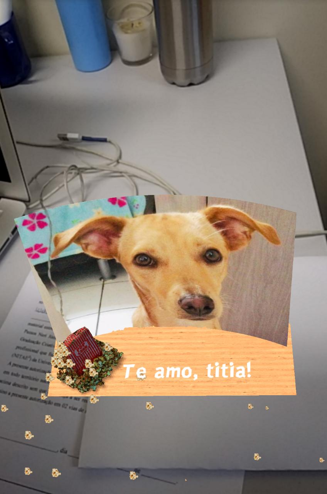

# Pipoca

## Ferramentas usadas

1. Personalização de marcador:

    - [AR.js Marker training](https://jeromeetienne.github.io/AR.js/three.js/examples/marker-training/examples/generator.html)

2. Modelo 3D gratuito:
    - [Sketchfab](https://sketchfab.com/)

3. Conversor GLB:

    - [GLTF to GLB Packer](https://glb-packer.glitch.me/)

4. Textura:
    - [Textures.com](https://www.textures.com/)

5. Normal Map da textura (Dá efeito mais realístico):
    - [NormalMapOnline](https://cpetry.github.io/NormalMap-Online/)

6. Editor de imagem utilizado:
    - [GIMP](https://www.gimp.org/)

7. Gerador de Favicon:
    - [Favicon Generator](https://realfavicongenerator.net/)

8. Nome do cão modelo: **Pipoca**

## Como fica visto pelo smartphone e apontando para o marcador ?

- Marcador:

    

- Resultado:

